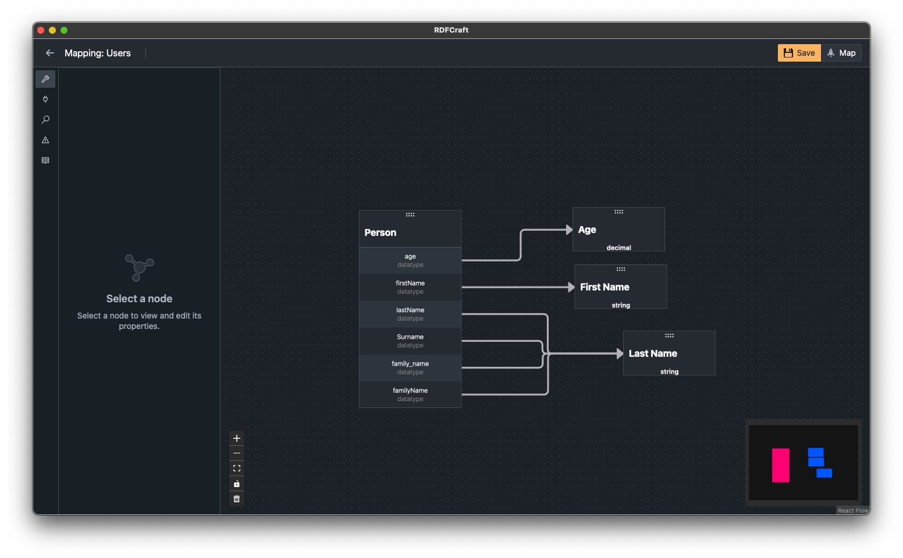
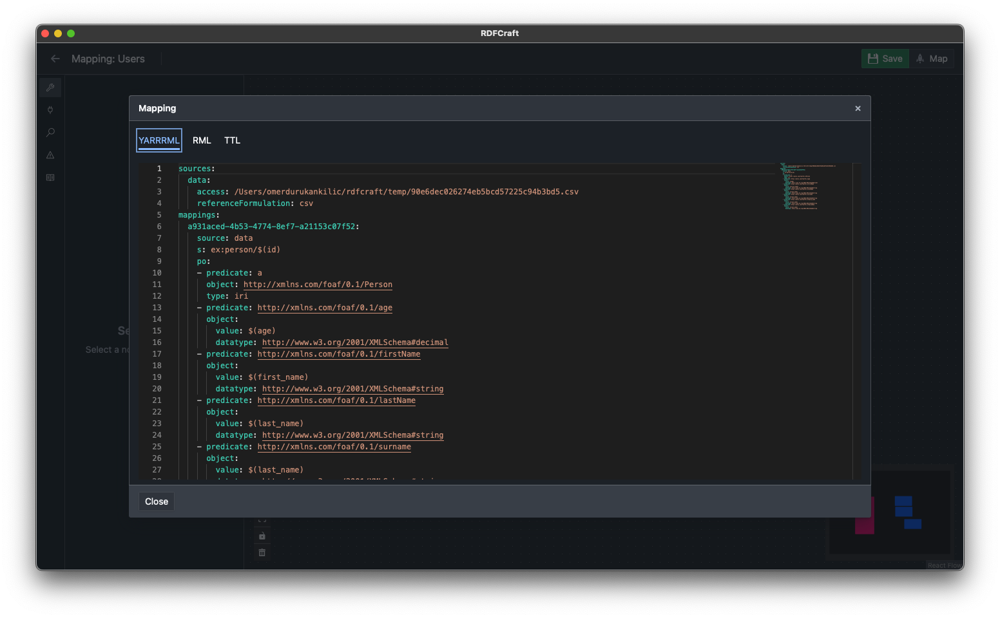

# Generating Mappings

After populating the mapping canvas by mapping all the desired data, you can now generate mappings after you saved your changes.

To save your mapping, press the orange **Save** button near the interface's top right corner. After the button turns green, you can generate mappings by pressing the **Map** button on its right. Given that no faulty URI's, wrong references, or invalid connections are detected; the mapping results will appear in an interactive window.

RDFCraft outputs completed mappings in three different formats. To switch between them, press **YARRRML**, **RML**, and **TTL** buttons. The details of these formats are as follows:

- **YARRRML**: Text-based declarative Linked Data generation rules, formatted to be human-readable. It is a readable representation of your mapping's structure. You can find out more [here](https://rml.io/yarrrml/spec/).
- **RML**: Stands for RDF Mapping Language. It is a generic mapping language designed to express serializations to the RDF data model. RDFCraft uses the RML format to map source data to TTL knowledge graphs. You can find out more [here](https://rml.io/specs/rml/).
- **TTL**: Stands for Turtle. It is a knowledge graph format where triples are written in a compact textual form. Human-readable and allows investigating how each data point relates to others in detail. The final knowledge graph output from RDFCraft. You can find out more [here](https://www.w3.org/TR/turtle/#language-features).

To utilize the results elsewhere, you can directly copy the lines from each output tab and paste them on the desired document. You can close the mapping results window by pressing either the **X** button on top right or the **Close** button on the bottom left.

[Previous: Mapping Interface](/guide/mapping-interface.md)
