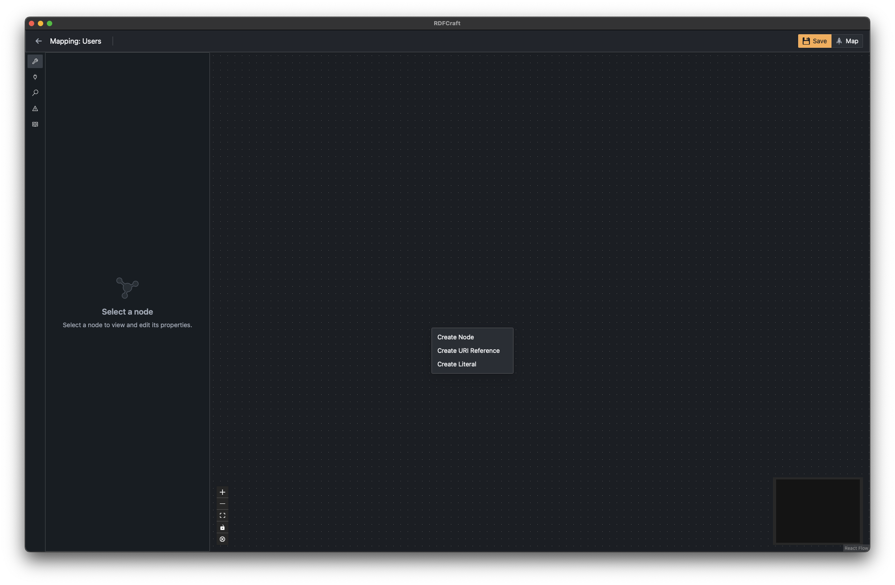
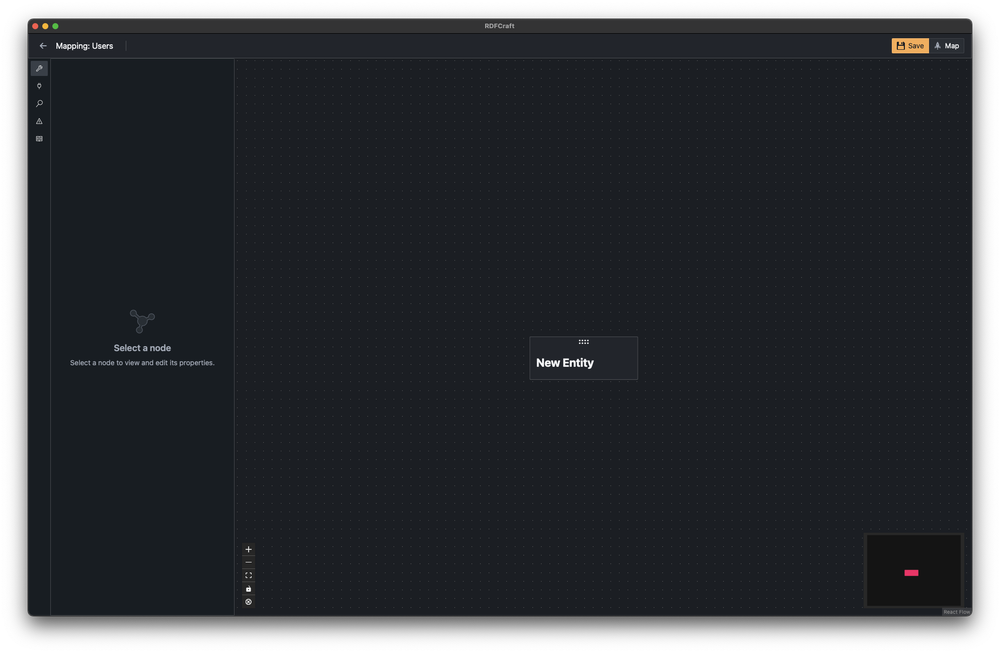
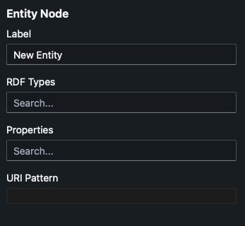
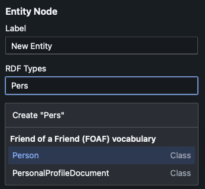
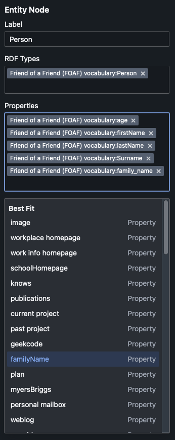
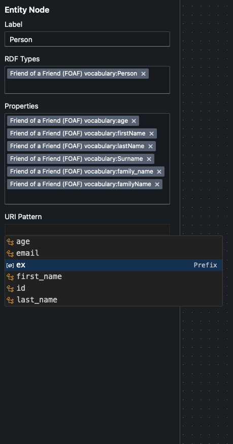
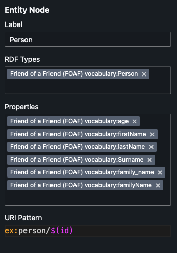
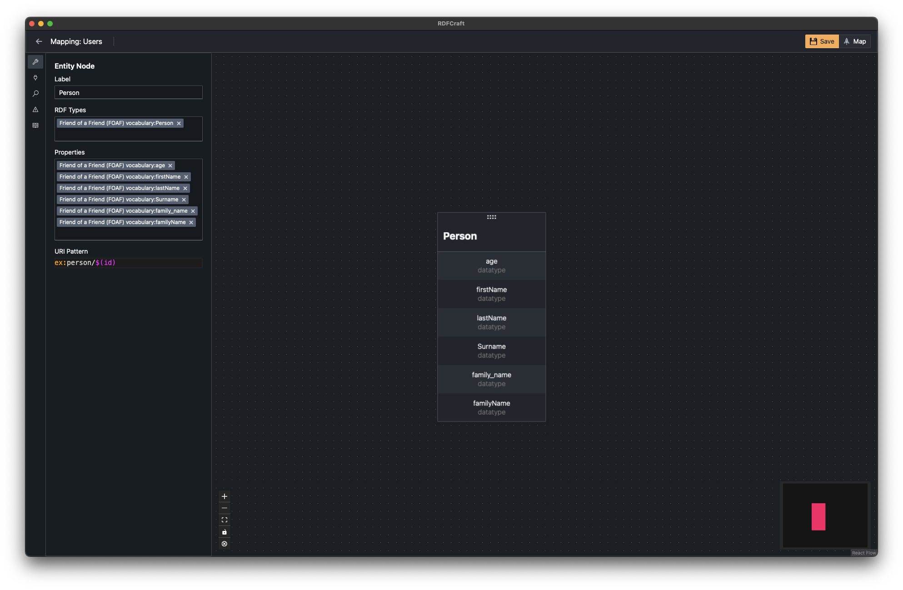
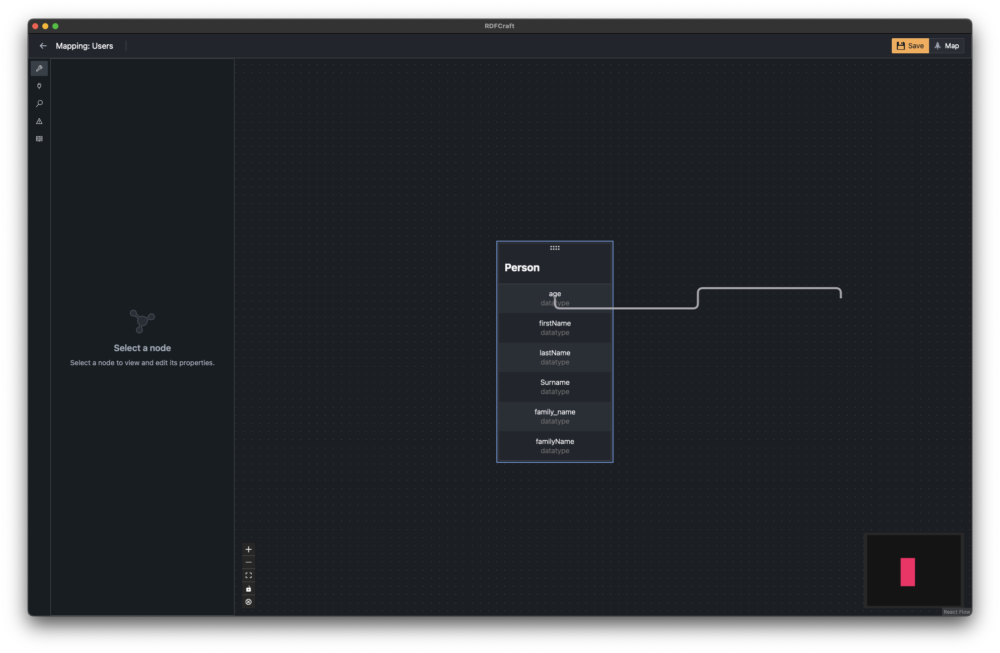
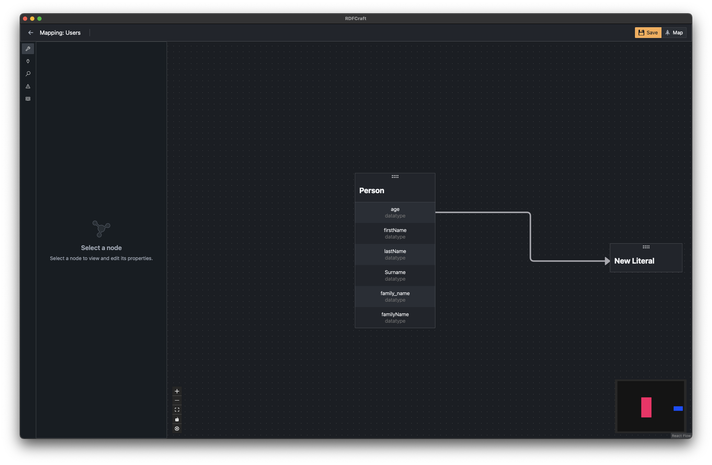

# Mapping Interface

Now that you have created a workspace, imported the ontologies you need,
added prefixes you will use, and created a mapping, you can start mapping your
data. Simply click on the **Open** button on the mapping you want to work on.


You will see the above screen. This is the mapping interface.

- The red box is the **Tabs** section. You can switch between different tabs
  using this section. From top to bottom, the tabs are:

  - **Entity Properties**: Shows the properties of selected entity. You can add classes, properties to entity. 
    Change its label and define its URI Pattern.
  - **AI**: Shows the AI recommendations for the mapping. You can
    accept or reject the recommendations. (WIP)
  - **Search**: Allows you to search the entities in you mapping.
  - **Problems**: Shows the problems in your mapping. You can click on
    the problem to see the details.
  - **References**: Shows the references (column names/keys) in your
    source file.

- The green box is Side Panel. This panel is collapsible and its width can be
  adjusted. It projects the selected tab from the red box.

- In the middle where it says **Mapping Canvas**, is where you will do your
  actual mapping. You can **Right Click** on the canvas to add a new node,
  literal or URI Reference.

- The blue box is the **Mapping Toolbar**. From top to bottom, the buttons are:

  - **Zoom In**
  - **Zoom Out**
  - **Fit to Screen**: Adjusts mapping canvas to the screen dimensions.
  - **Lock/Unlock**: It disables/enables the ability drag and drop entities on
    the canvas.
  - **Delete**: It deletes the selected entity.

- The purple box is the **Mini Map**. It shows the whole mapping canvas in a
  small scale. You can use it to navigate the canvas.

- On top right corner, you can see the **Save** and **Map** buttons. **Save**
  button saves the mapping and **Map** button generates the RML mapping.

> [!Warning]
>
> System does not save the mapping automatically. You need to click on the
> **Save** button to save the mapping. It is color coded. If it is orange, it
> means you have not saved the mapping.
>
> Also to **Map** the mapping, you need to save it first.

## Creating Nodes

To create a node, right click on the canvas and select **Create Node**. It will
place a Node on the canvas.





After its creation, you can click on the node to see its properties on the **Node Properties** panel.



- **Label**: The label of the node. It is only used to increase the readability
  of the mapping. It is not used in the actual mapping process.

- **RDF Types/Properties**: The RDF types and properties of the node. You can
  add multiple RDF types/classes and properties to a node.

  After you click on the text box, you will see a dropdown list of classes from
  the ontologies you have imported. You can select one or more classes from this
  list.

  This dropdown also shows the classes/properties that is best matched with the
  existing connections.

  If you don't have the class you want to use in the list, you can type the URI
  and click **Create ...** option.





- **URI Pattern**: The URI pattern of the node. URI patterns are used to
  generate unique URIs for unique entities. This field supports auto complete
  and you can access it by pressing `Ctrl + Space` (or `Cmd + Space` on Mac).

  You can use the prefixes you have added in the workspace in the URI pattern.
  You can use references (column names/keys) in the source file in the URI with
  following syntax:

  ```
  $(reference_name)
  ```

  At the end these references will be replaced with the actual values in your
  data.





After you have added the classes, properties, and URI pattern, your node should 
resemble the following:



## Creating Connections

To create a connection between two nodes, you can drag from a property of a node
to head of another node. (or vice versa).

You can also quickly create nodes and connections by dragging from a property of
a node and dropping it on the canvas. It will create show you the options to
create either a new node, literal or URI reference.





You can again click on the newly created node to see and edit its properties.


You can continue creating nodes and connections until you have mapped all desired
data.

You can check which references you have used in the mapping by clicking on the
**References** tab. (WIP)

[Previous: Mappings](/guide/mappings.md) |
[Next: Generating Mappings](/guide/generating-mappings.md)