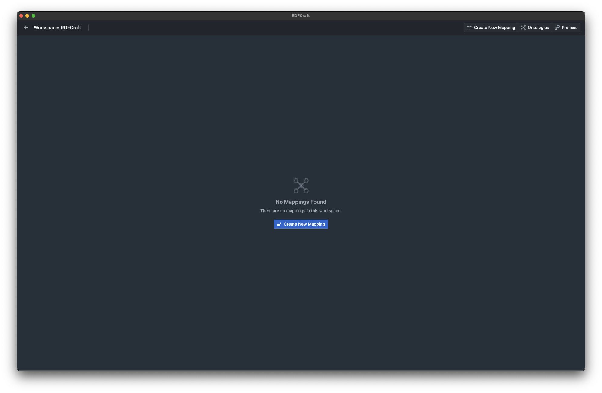
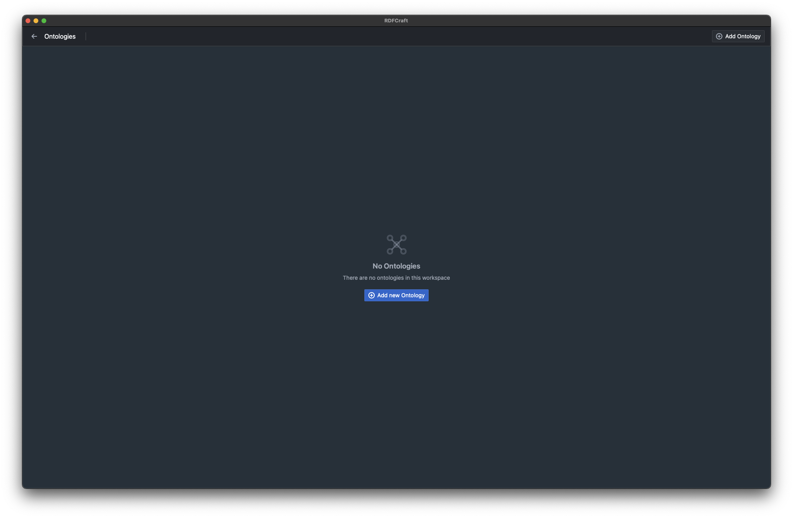
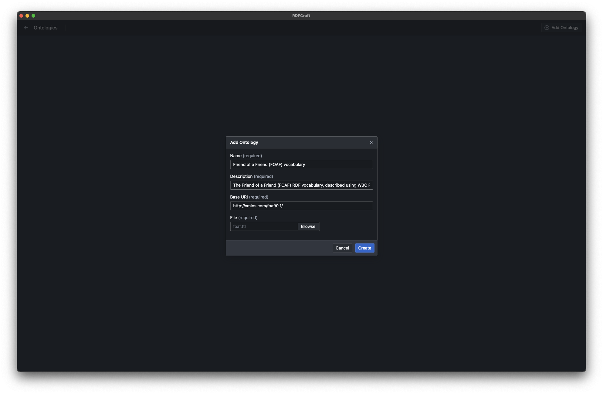
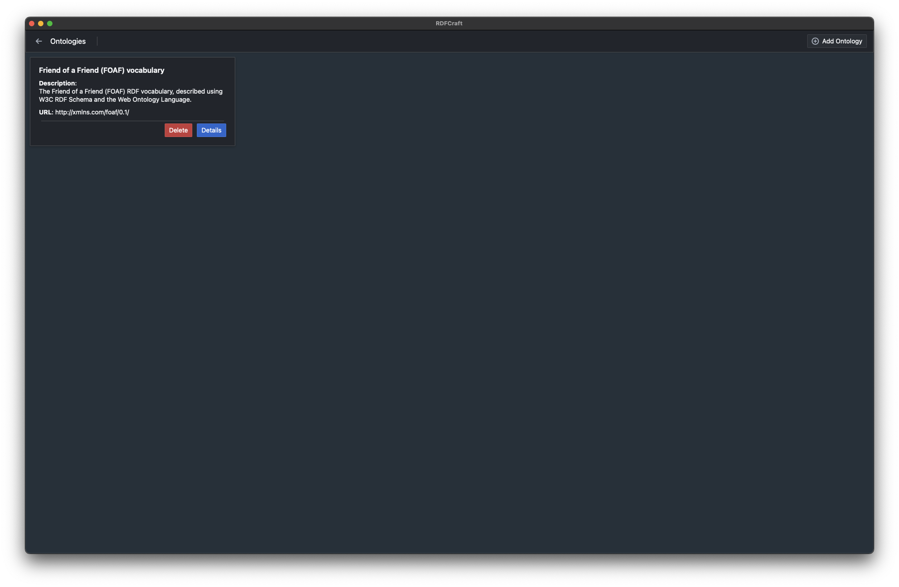
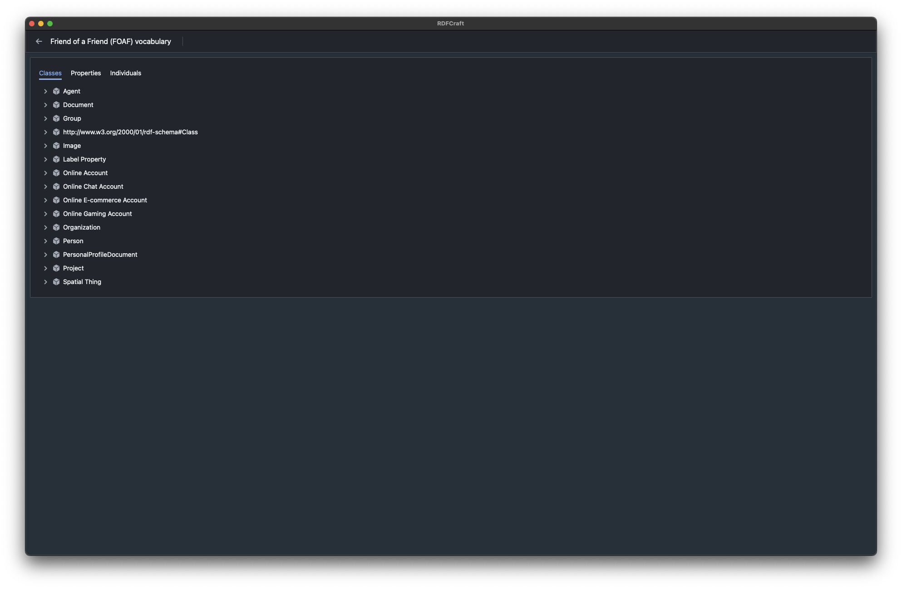

# Ontologies

RDFCraft is capable of indexing and using multiple ontologies to provide a better user
experience. It indexes all the classes and properties from the provided ontology
and provides recommendations while mapping.

You can map your entire data without using any ontology, but using an ontology
will make the mapping process easier and more accurate.

## Adding an ontology

To add an ontology, after you open your workspace, click on the **Ontologies**
tab on the top right corner of the screen. You will see a list of all the
ontologies that is imported in the workspace.

Click on the **Add Ontology** button to add a new ontology. You will be prompted
to enter the details of the ontology.

- **Name**: The name of the ontology.
- **Description**: A brief description of the ontology.
- **Base URI**: The base URI of the ontology.
- **File**: The file path of the ontology. You can use any RDF file format you
  like.

Out of these fields, only **File** is important. Others are still required but
used for display/metadata purposes.

After you add the ontology, you can see all the classes, properties, and
individuals indexed from it by clicking **Details**.

[Previous: Workspaces](/guide/workspaces.md) |
[Next: Prefixes](/guide/prefixes.md)
