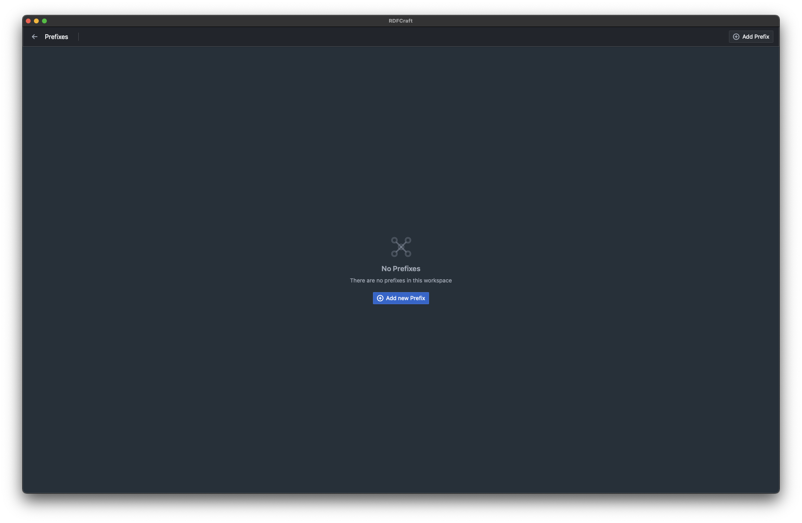
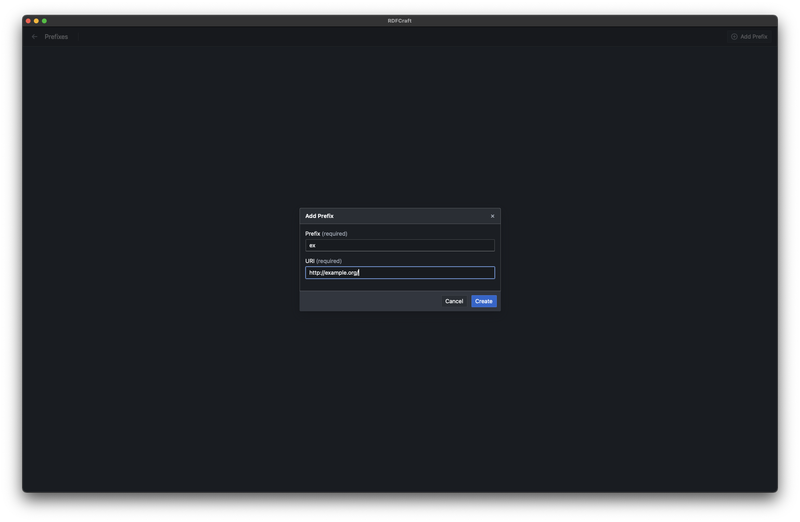
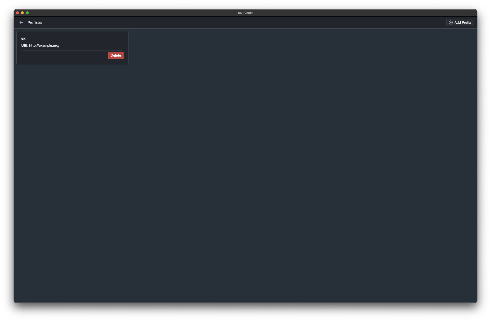

# Prefixes

RDFCraft uses prefixes to shorten the URIs in the mapping process. This step is
optional but it is recommended to use prefixes to make the mapping process
easier and more readable.

## Adding a prefix

To add a prefix, after you open your workspace, click on the **Prefixes** tab on
the right top corner of the screen. You will see a list of all the prefixes that
is created in the workspace.

Click on the **Add Prefix** button to add a new prefix. You will be prompted to
enter the details of the prefix.

**Prefix**: The prefix that you want to use in the mapping process. It should be
a alphanumeric string.

**URI**: The URI that the prefix will be mapped to. It should be a valid URI.

After you enter the details, click on the **Add** button to add the prefix.

[Previous: Ontologies](/guide/ontologies.md) |
[Next: Mappings and Sources](/guide/mappings.md)
