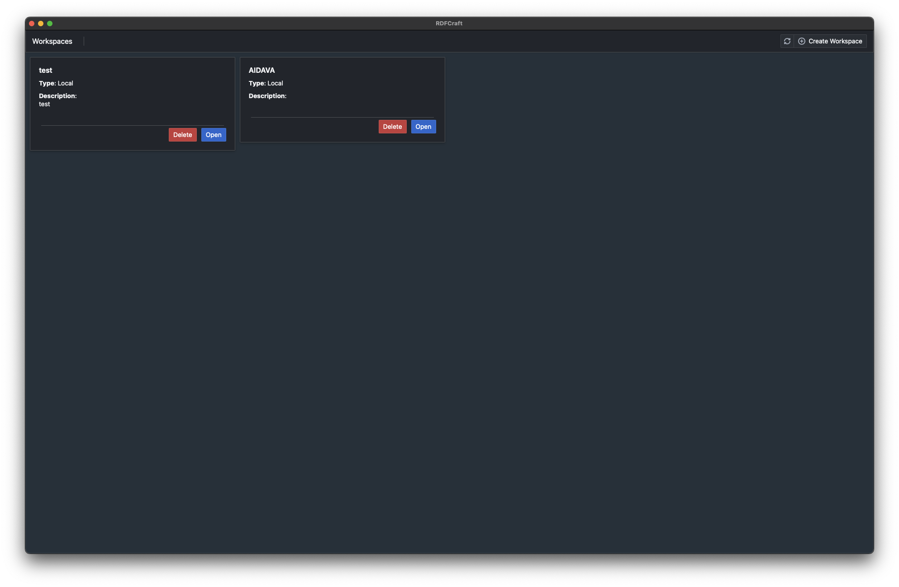
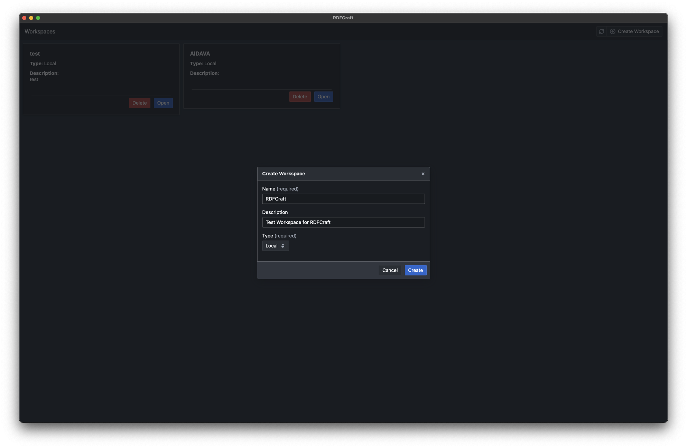

# Workspaces

Workspaces are a way to organize your projects in a way that makes sense to you.
You can create as many workspaces as you want, and each workspace contains its
own set of mappings. These mappings will share ontologies and prefixes.

## Creating a workspace

To create a workspace, click on the **Create Workspace** button in the top right
corner of the screen. You will be prompted to enter a name for your workspace.

After that, you will need to fill in the details for your workspace.

> [!Warning]
>
> For now, select **Local** as the workspace type. Remote workspaces are WIP.

After you have filled in the details, click on the **Create** button. Your new
workspace will be created and you can click **Open** to start working on it.

[Next: Ontologies](/guide/ontologies.md)
